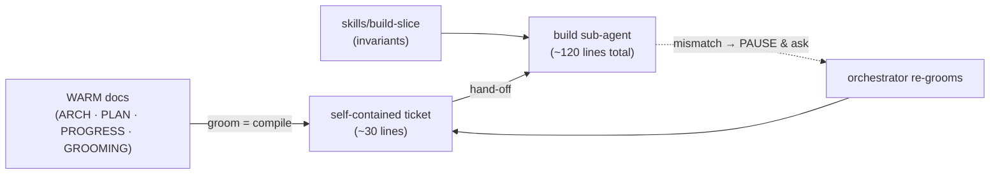

# CareerEngine — Context-management strategy

> **Status:** `active` · **Last reviewed:** 2026-07-10
> **Job:** the single source of truth for **how context is loaded, scoped, and retired** across
> agentic development. If a future agent (Claude Code, Copilot, Antigravity, or a sub-agent) is
> deciding "what should I read / what should I hand a builder / where does finished work go," this
> file is the answer. It exists so we **don't stray** as the project grows.
>
> This is process/context governance. It complements — does not replace —
> [HANDOFF.md](HANDOFF.md) (resume point), [PROGRESS.md](PROGRESS.md) (status),
> [ARCHITECTURE.md](ARCHITECTURE.md) (design), [REFINED_PROJECT_PLAN.md](REFINED_PROJECT_PLAN.md)
> (roadmap), and [GROOMING.md](GROOMING.md) (current-phase build specs).

---

## Why this exists

Durable state lives in `docs/`, and this repo is worked on across multiple AI tools. As the docs
grow, the failure mode is **context bloat**: every agent gets pointed at every big doc, burning
tokens and attention on material it doesn't need. Left unchecked, `GROOMING.md` alone reached 2,281
lines — ~2,000 of which were *completed* work no builder should ever load. This strategy keeps the
context each agent loads small, current, and role-appropriate, without losing any history.

## The three-way separation (most important idea)

Every piece of durable knowledge is exactly one of three kinds. Keep them in different places and
never let them blur:

| Kind | Changes | Home | Loaded how |
|------|---------|------|-----------|
| **Invariants** — rules that are true for every build | rarely | `skills/` | on demand, by the agent doing that kind of work |
| **Current state** — what's true right now | constantly | `HANDOFF.md`, `PROGRESS.md`, current-phase `GROOMING.md` | orchestrator pulls when needed |
| **History** — what was true / what shipped | append-only | `docs/history/` | **retrieval only** (grep / semantic search), never loaded whole |

If you find yourself putting an invariant into GROOMING, or leaving finished tickets in GROOMING, or
copying current status into a design doc — stop; it belongs in one of the other two homes.

## Context temperature (what loads when)

```
🔥 HOT   always in context (~130 lines)   instruction files + HANDOFF resume banner
🌤 WARM  orchestrator pulls on demand      PROGRESS · ARCHITECTURE · PLAN · current-phase GROOMING
🧊 COLD  retrieval only, never whole       docs/history/*  (archived tickets & decisions)
🧰 SKILL on demand, per activity           skills/*  (durable invariants & procedures)
```

Budget: keep HOT tiny and curated. Keep WARM current (retire finished work promptly, see below).
COLD can grow without bound — it never inflates what any agent loads.

## Role-scoped reading: orchestrator vs build sub-agent

These are **different readers with different needs**. Do not give them the same reading list.

- **Orchestrator** (the agent driving the session; grooms, reviews, gates, reconciles docs):
  reads the HOT + WARM set. Owns the big picture.
- **Build sub-agent** (implements one code slice): reads a **self-contained ticket** + the relevant
  `skills/build-slice` invariants + the one `ARCHITECTURE.md` section its slice touches.
  It does **NOT** read `HANDOFF.md`, `PROGRESS.md`, `REFINED_PROJECT_PLAN.md`, or `GROOMING.md`
  wholesale. If the ticket's assumptions don't match the code, it **PAUSEs and asks the
  orchestrator** — it does not go spelunking the big docs, and it does not assume.

## When to spawn a sub-agent — it's a scaling tool, not the default build path

A spawned sub-agent is **not free** and **not the default**. It carries two costs this strategy used
to underweight:

- **Cold re-derivation.** A fresh agent starts with none of the orchestrator's working context and
  must re-read the ticket + skill + one ARCHITECTURE § before it can act.
- **Integration tax.** Its output must be gated and reconciled by an orchestrator who *never watched
  it think* — so mismatches are reverse-engineered after the fact, not caught in the moment.

**Default to doing the work inline** (in the orchestrator's own context). Spawn a sub-agent only when
**all three** hold:

1. The work is genuinely **parallel / file-disjoint** (multiple slices that don't touch the same files).
2. It is **big enough** that a clean ~120-line context beats carrying it inline.
3. It is **cleanly specifiable up front** (a self-contained ticket, no exploratory back-and-forth).

If you already hold the context (e.g. finishing or fixing a slice you just gated), spawning is
**strictly worse** — more tokens, lower quality. Do it inline. Use sub-agents to *scale out*
disjoint work, not to offload work you're already positioned to do well.

## When is context assembled? Grooming, not hand-off

This is the mental model to keep:

- **Grooming time** (orchestrator + Opus, design-heavy) is the *expensive* context pull. The
  orchestrator reads the WARM set, resolves open questions / PAUSE points, and **distills all of it
  into a self-contained ticket.** The big docs are consumed once, here, to produce a compact spec.
- **Hand-off time** (spawning the builder) is *cheap*. The orchestrator does **not** re-read the big
  docs; it assembles `skills/build-slice` + the already-groomed ticket + a pointer to one
  ARCHITECTURE §.

So **the ticket is a compiled artifact.** Grooming is the "compile" step that front-loads context so
the builder runs on ~120 lines instead of thousands. A builder that hits a mismatch bounces back to
the orchestrator for a re-groom rather than loading more context itself.

**Compile anchors, not just prose.** A cold builder that cannot grep straight to the right place
burns tokens flailing. So the ticket names the **exact `file:symbol` anchors** it needs (e.g. "reuse
`web/grill_labels.py:_effective_frontier_label`", "bind `schema.py:UserProfile`") — retrieval becomes
a lookup, not a search. Pointers are the compiler's output too, not just the narrative.



## Retrieve, don't ingest

Never paste a large doc into a sub-agent. Give a pointer and let the agent pull the one section it
needs with whatever workspace search tools its runtime provides (grep / glob / semantic search — e.g.
`grep_search` / `semantic_search` / `file_search` in some runtimes, `grep` / `glob` in others). Those
tools **are** the retrieval layer. To keep them effective, keep docs greppable: stable headers, clear
section anchors, and freshness banners on anything durable.

## Build-time discipline (gate-first · resumable · risk-tiered review)

These three rules exist because the expensive failure is **not** loading a doc you didn't need — it is
**inheriting an ungated or broken pile of work** and paying model tokens to reverse-engineer it. Spend
model tokens on *judgment*; spend cheap deterministic compute (lint / typecheck / tests / e2e /
bundle) on *verification*.

- **Gate-first (walking skeleton).** The gate must **exist and be green before any feature code**.
  Stand up the scaffold + one trivial passing test + the gate wired into CI as the first commit (or a
  tiny first slice), then build features against a permanently-green check. A slice that has to build
  *its own* gate from scratch has no safety net mid-flight — that is how an interruption leaves a
  broken tree (learned the hard way on Phase 10.5).
- **Resumability — commit at green checkpoints.** Durable state lives in `docs/` for *decisions*; the
  **branch is the durable unit for in-flight code**. Builders commit at **gate-green checkpoints**,
  not as one big final commit. Interruption is normal (an agent stops, a usage limit hits) — whoever
  resumes must inherit a green partial tree, never a broken one. "Done" means **gate-green**, not
  "files written."
- **Risk-proportional review.** Two independent heavyweight reviews on *every* slice is reckless
  spend. Tier by blast radius:
  - **Contract- or security-touching** (`schema.py`/`config.py`/auth/public interfaces, a
    `CONTRACT_VERSION` bump) → two independent reviews.
  - **Presentation / transport-only, with strong local gates** (typecheck + tests + e2e + bundle
    green) → one automated reviewer + the orchestrator's own read is enough.
  Match the review depth to what can actually break.

## The retire ritual (keeps WARM small forever)

When a phase's tickets are all ✅ and merged:

1. Move those tickets from `GROOMING.md` to `docs/history/GROOMING_ARCHIVE.md` **in the same
   session** (same discipline as "reconcile docs before you stop").
2. Leave a one-line pointer in `GROOMING.md`'s launch order; keep canonical status in `PROGRESS.md`.
3. Stamp the archived block `historical` with a date.

`GROOMING.md` then only ever holds the **current phase** (~150 lines), so it never bloats what the
orchestrator loads. Apply the same ritual to any other doc that accumulates finished work.

## Freshness & provenance

Every durable doc declares `status` (`draft` / `active` / `frozen` / `superseded` / `historical`) +
last-reviewed date at the top. Archived blocks keep their status so that **if** search surfaces them,
the agent immediately sees they are cold and won't act on stale guidance as if it were live.

## On RAG — deliberately deferred (not overkill-by-default, but not yet)

We are **not** adding a vector-DB RAG. Rationale, and the tripwire for revisiting:

- The workspace search tools already provide on-demand retrieval over the whole repo (a "poor-man's
  RAG") with zero infra and no re-index/staleness burden.
- On a *live* spec, a RAG's real risk is surfacing a superseded chunk **without** its freshness
  banner and acting on it. Structured markdown + git history + freshness headers is more auditable.
- A RAG adds an embedding pipeline, a vector store, chunking, and a re-index obligation — real
  maintenance for a corpus that is currently small.

**Revisit RAG only when all three hold:** (a) the archive is large enough that even a human can't
find a past decision, (b) we want semantic recall across hundreds of retired tickets, and (c)
grep / semantic-search is demonstrably missing things. Even then, prefer a lightweight local index
over a hosted vector DB, and always carry the freshness marker into the retrieved chunk.

## Checklist for future agents (don't stray)

- [ ] Am I about to hand a builder a big doc? → No. Hand a ticket + `skills/build-slice` + one § pointer.
- [ ] Am I about to spawn a sub-agent? → Only if the work is parallel/disjoint, big, and cleanly
      specifiable. If I already hold the context, do it **inline**.
- [ ] Does the ticket name exact `file:symbol` anchors? → Compile pointers, not just prose.
- [ ] Is there a green gate to build against *before* the feature code? → Gate-first; walking skeleton.
- [ ] Am I committing at gate-green checkpoints so an interruption leaves a green tree? → Yes.
- [ ] Does the review depth match the blast radius? → Two reviews for contract/security; one + my read
      for presentation-only with strong local gates.
- [ ] Is this an invariant? → It goes in a skill, not in GROOMING.
- [ ] Is this finished work still sitting in GROOMING? → Retire it to `docs/history/` this session.
- [ ] Is this current status living in a design/roadmap doc? → Move it; status is canonical in PROGRESS.
- [ ] Did I add a durable doc without a freshness header? → Add `status` + last-reviewed date.
- [ ] Am I reaching for RAG? → Re-read the tripwire above first.
